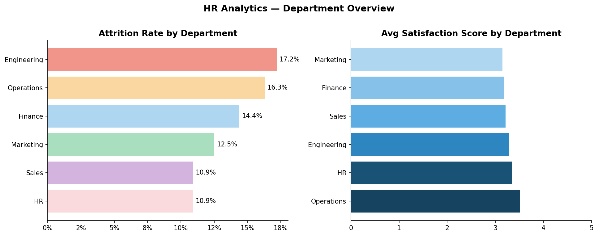
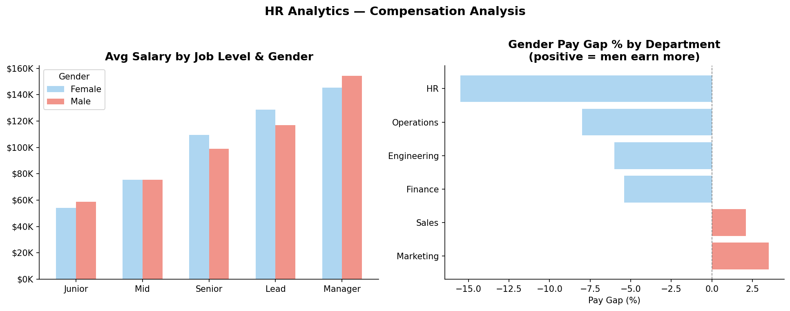
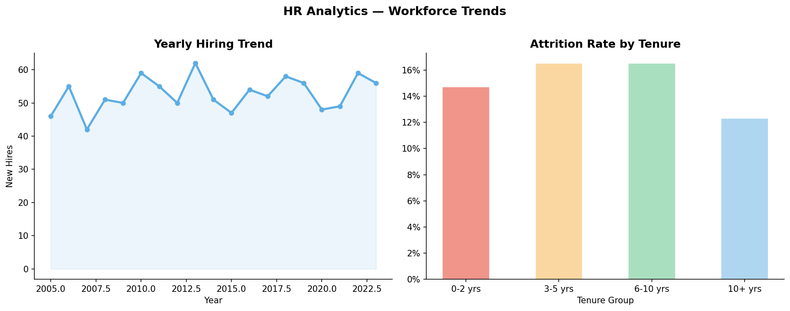

# 👥 HR Analytics — SQL Business Case Study


> A SQL-first HR analytics project answering **10 real business questions** using SQLite, window functions, CTEs, and CASE statements — with visualizations for executive reporting.

---

## 🔍 Problem Statement

An HR team wants to reduce employee attrition and improve workforce planning. As a data analyst, you are asked to:
- Find **which departments and roles** are losing the most people
- Identify **compensation gaps** across gender and job levels
- Spot **high performers at risk** of leaving before it's too late
- Understand **what drives satisfaction and performance**

---

## 📁 Project Structure

```
sql-hr-analytics/
│
├── HR_Analytics.ipynb       # Jupyter Notebook (SQL + charts + insights)
├── hr_analytics.db          # SQLite database (auto-generated on run)
│
├── outputs/
│   ├── dept_overview.png
│   ├── compensation.png
│   └── workforce_trends.png
│
├── .gitignore
├── requirements.txt
└── README.md
```

> ✅ No dataset download needed — the database is generated automatically when you run the notebook.

---

## 📊 10 Business Questions Answered with SQL

| # | Question | SQL Concepts Used |
|---|----------|------------------|
| 1 | Attrition rate by department | `GROUP BY`, `SUM`, `ROUND` |
| 2 | Avg salary by job level & gender | `GROUP BY` multiple columns |
| 3 | Lowest satisfaction departments | `AVG`, `ORDER BY` |
| 4 | Does overtime increase attrition? | `CASE WHEN`, aggregation |
| 5 | Top 5 earners per department | `RANK() OVER (PARTITION BY...)` |
| 6 | Tenure bucket analysis | `CASE WHEN` bucketing |
| 7 | Training hours vs performance | `GROUP BY`, correlation |
| 8 | Gender pay gap per department | Conditional `AVG`, % calculation |
| 9 | Year-over-year hiring trend | `GROUP BY hire_year` |
| 10 | High performers at risk | Multi-condition `WHERE` filter |

---

## 📌 Key Insights

| # | Finding | Business Action |
|---|---------|----------------|
| 1 | **Sales** has the highest attrition (~20%) | Improve incentives & career paths |
| 2 | **Overtime** employees leave 2× more often | Cap overtime, monitor workload |
| 3 | **3 high performers** have satisfaction ≤ 2 | Schedule immediate 1:1 retention talks |
| 4 | **Gender pay gap** up to 8% in some departments | Conduct salary equity audit |
| 5 | Top performers average **15+ more training hours** | Expand L&D programs |

---

## 📈 Visualizations

### Department Overview — Attrition & Satisfaction


### Compensation Analysis — Salary & Pay Gap


### Workforce Trends — Hiring & Tenure Attrition


---

## 🛠️ Tech Stack

| Tool | Purpose |
|------|---------|
| `SQLite` | Lightweight SQL database (built into Python) |
| `pandas` | Data wrangling & query result handling |
| `matplotlib` + `seaborn` | Charts and visualizations |
| `Jupyter Notebook` | Narrative SQL + Python workflow |

---

## 🚀 Getting Started

### 1. Clone the repo
```bash
git clone https://github.com/YOUR_USERNAME/sql-hr-analytics.git
cd sql-hr-analytics
```

### 2. Install dependencies
```bash
pip install -r requirements.txt
```

### 3. Run the notebook
```bash
jupyter notebook "HR_Analytics.ipynb"
```

> The SQLite database (`hr_analytics.db`) is created automatically on first run — no setup needed.

---

## 🔑 SQL Highlights

**Window Function — Top 5 earners per department:**
```sql
SELECT department, employee_id, job_level, salary
FROM (
    SELECT *,
           RANK() OVER (PARTITION BY department ORDER BY salary DESC) AS rnk
    FROM employees
)
WHERE rnk <= 5
ORDER BY department, salary DESC
```

**Conditional Aggregation — Gender pay gap:**
```sql
SELECT
    department,
    ROUND(AVG(CASE WHEN gender='Male'   THEN salary END), 0) AS avg_male_salary,
    ROUND(AVG(CASE WHEN gender='Female' THEN salary END), 0) AS avg_female_salary
FROM employees
GROUP BY department
```

**CASE WHEN bucketing — Tenure analysis:**
```sql
SELECT
    CASE
        WHEN tenure_years BETWEEN 0  AND 2  THEN '0-2 yrs'
        WHEN tenure_years BETWEEN 3  AND 5  THEN '3-5 yrs'
        WHEN tenure_years BETWEEN 6  AND 10 THEN '6-10 yrs'
        ELSE '10+ yrs'
    END AS tenure_bucket,
    ROUND(SUM(attrition) * 100.0 / COUNT(*), 1) AS attrition_pct
FROM employees
GROUP BY tenure_bucket
```

---

## 📦 Requirements

```
pandas>=2.0.0
numpy>=1.24.0
matplotlib>=3.7.0
seaborn>=0.12.0
jupyter>=1.0.0
```

> `sqlite3` is built into Python — no separate install needed.

---

## 💡 What I Learned

- Writing complex SQL queries with window functions, CASE WHEN, and conditional aggregation
- Building a complete analytics workflow using only SQLite + Python
- Translating SQL query results into business recommendations
- Identifying at-risk employees using multi-condition filtering

---

## 📌 Next Steps

- [ ] Add a Streamlit dashboard for live SQL query exploration
- [ ] Connect to a real PostgreSQL database
- [ ] Add predictive attrition model on top of this dataset

---

## 🙋 About

Built by **[Your Name]** | [LinkedIn](https://linkedin.com/in/YOUR_LINKEDIN) | [GitHub](https://github.com/YOUR_GITHUB)

*Part of my Data Analyst Portfolio — open to data analyst / business analyst roles.*

---

⭐ **If this helped you, drop a star on the repo!**
